# QFLASH21

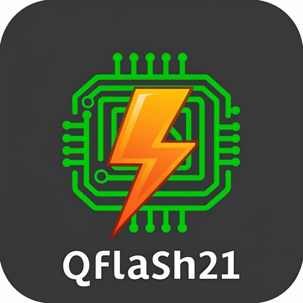

**Lokales Diagnose- und Flash-Tool für BMW DDE4 (EDC15C4) über K-Line / KWP2000 – direkt im Browser, PWA-fähig für Android & Desktop.**

[](https://vercel.com/batko15s-projects/qflashk)
[](https://supabase.com/dashboard/project/twredhbyehjxoadrbcqe)
[](https://nextjs.org)
[](#android-nutzung)
[]()

QFLASH21 kommuniziert mit der Motorsteuerung **DDE4** der BMW-Diesemodelle:

| Baureihe | Modelle | Motor |
|---|---|---|
| E38 | 730d | M57D30 |
| E39 | 525d / 530d | M47/M57 |
| E46 | 330d / 330xd | M57D30 |
| E53 | X5 3.0d | M57D30 |

---

## ✨ Funktionen im Detail

### 🔌 ECU-Identifikation
- **5-Baud-Init** über FTDI-BREAK-Signal (200 ms/Bit, LSB-first)
- KWP2000-Slow-Init mit Schlüsselwortprüfung (erwartet **0x45 0x05** für DDE4.0)
- Vollständige Ident: Bosch-Nummer, Software-/Hardwarestand, Fahrzeug-Erkennung
- Adaptive Echo-Erkennung (K-Line-Spiegelung) und 0x78-Pending-Handling

### 🚨 Fehlerspeicher (DTC)
- **Normaler Speicher** (Service 0x18 FF00) **und** DDE4-**Schattenspeicher** (0x18 FD00)
- **51 EDC15-Fehlernummern** mit deutschen Beschreibungen (inkl. Ladedruckregelung, IMMO, CAN)
- Status-Byte-Dekodierung (aktuell/sporadisch/pendierend/bestätigt)
- Löschen beider Speicher (Service 0x14) mit Bestätigung
- **KI-Werkstattanalyse** (LLM) mit Offline-Fallback-Hinweisen
- Bericht als Markdown exportierbar

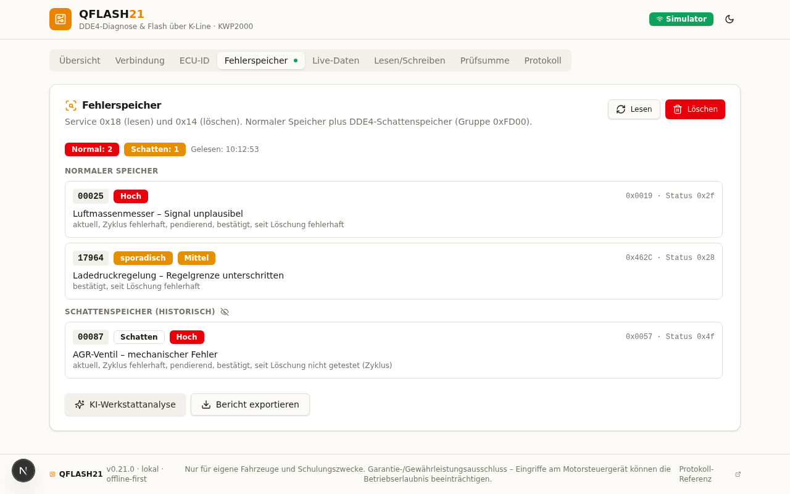

### 📈 Live-Daten
- **5 Messwertblöcke** (0x03/0x07/0x13/0x15/0x17): Drehzahl, Temperaturen, Ladedruck, Luftmasse,
  Einspritzbeginn, AGR/Lader-Position, Öl-/Abgastemperatur (AT1/AT2, EDC15C4-Zusatzsensoren)
- 600-ms-Polling mit Kreuzzeiger-Gauges + Sparkline-Verläufen
- **Seiten-Konfigurator** (DeepOBD-Prinzip): Blöcke für Round-Robin-Polling frei wählbar, persistiert
- **Kompaktansicht** aller Seitenblöcke + Grenzwert-Badges
- **Aufzeichnung** (bis 1500 Frames) mit **CSV-** (Excel) **und TSV-Export** (DeepOBD/MultiEcoScan-Stil)

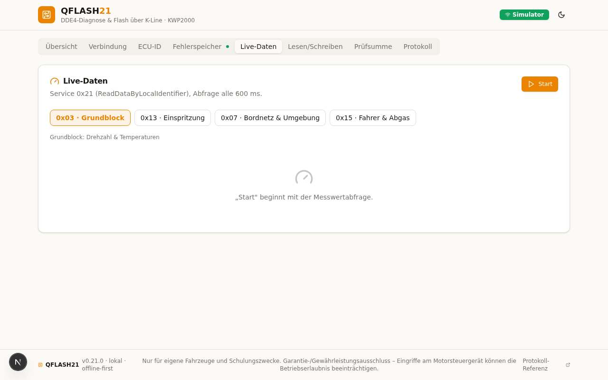

### 🔧 Steuergeräte-Jobs (DeepOBD-inspiriert)
Vom e90-Forum-Thread zu Deep OBD übernommenes Prinzip – freie Jobs mit vollem Funktionsumfang:
- **ECU-Reset** (0x11): Steuergerät-Neustart inkl. sauberem Session-Abbau + Auto-Reconnect
- **Routinen** (0x31): Glühkerzen-Funktionstest (je Zylinder), Laufunruhe-/Zylinder-Abschalttest,
  AGR-Funktionstest, Adaptionswerte zurücksetzen, Test-Leerlauf +250 1/min
- **Aktuatorik** (0x30): Glühstiftrelais, Lüfter, AGR, Ladedruckregelventil N75, Kraftstoffpumpenrelais
- **Info-Felder** (0x1A): ZUSB/Teilenummer, AIF/Codierung – wie DeepOBD „ZUSB/AIF anzeigen“
- Sicherheitsstufen (safe/caution/danger), Bestätigungsdialoge, Job-Historie (12 Einträge)
- Live-Side-Effects sichtbar: Test-Leerlauf → Drehzahl-Gauge, AGR-Test → Block 0x15

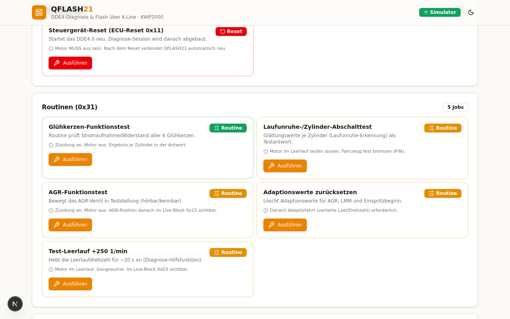

### 💾 Flash & BIN-Verwaltung
- **Flash lesen**: FULL (512 KiB) und CAL (48 KiB) über Services 0x35/0x36
- **BIN-Upload** mit Automatik-Erkennung (FULL/CAL), Diff-Vergleich, Hex-Dump
- **Bosch-CR2-Prüfsummen**: 16-KiB-Bänke, 2×16-Bit-Summenwörter LE, 16 KiB Schutzzone
- Automatische Korrektur falscher Bänke mit Vorher/Nachher-Anzeige
- **Schreib-Gate**: dreiagige Sicherung (Phrase „QFLASH21“ + Spannung ≥ 12 V + Backup-Pflicht)

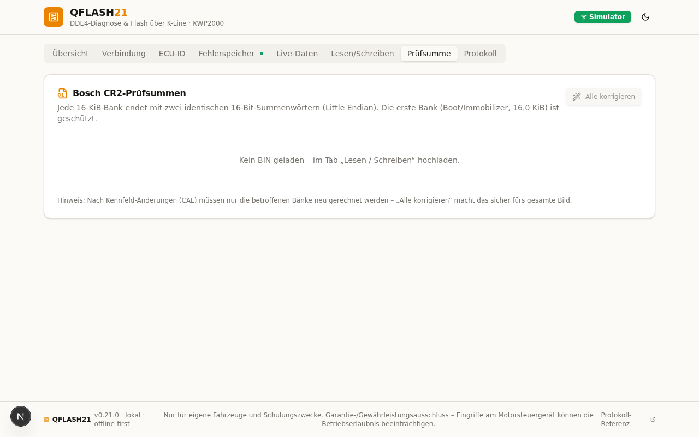

### 📜 Protokoll & OperationLog
- Vollständiges Kommunikationslog (HEX + Zeitstempel + Richtung)
- Dauerhafte Operationshistorie in **Supabase Postgres** (`OperationLog`)

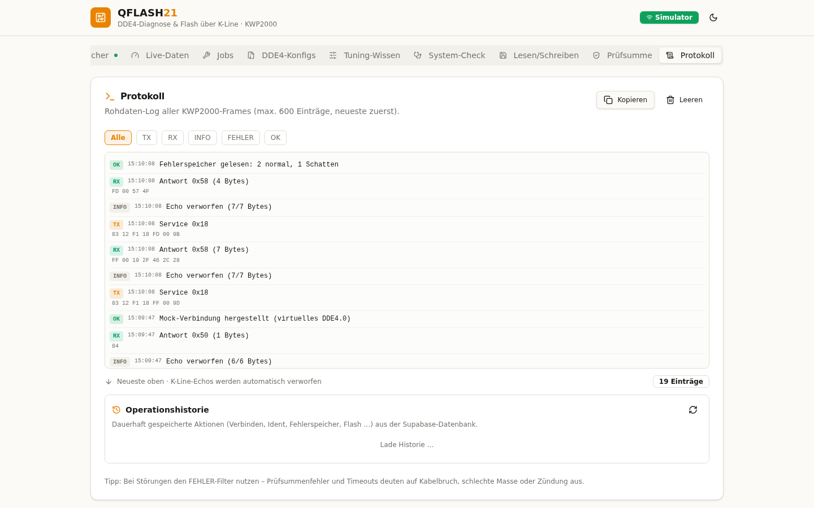

### 🧪 Simulator (ohne Fahrzeug testbar!)
Virtuelles DDE4.0 mit echter 5-Baud-Flankendekodierung, K-Line-Echo, DTCs, Live-Werten
und 512-KiB-Fake-Flash – **die komplette App inkl. aller Jobs ohne Hardware testbar**.

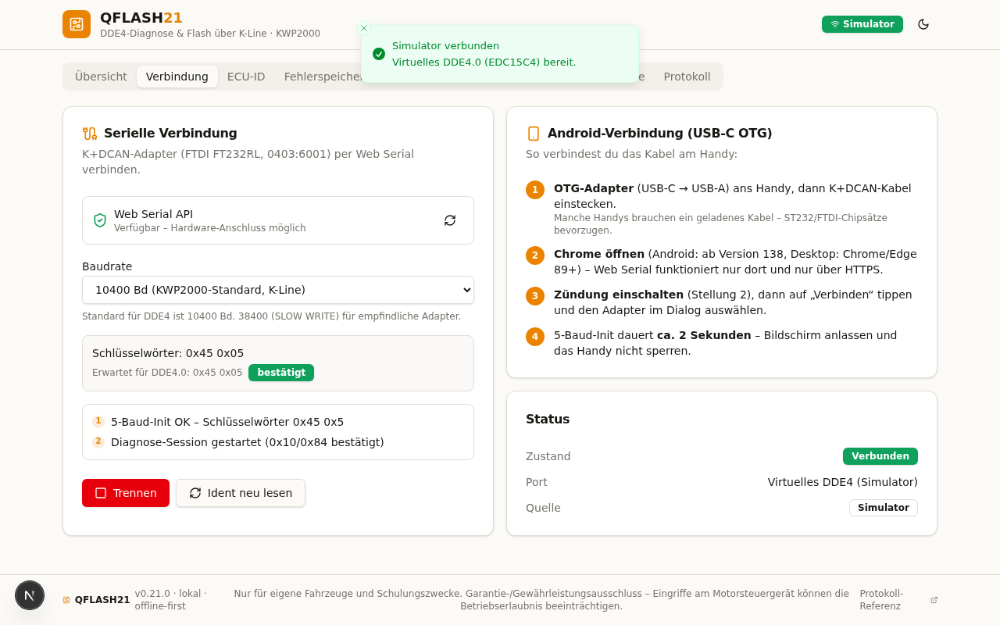

### 📦 DDE4-Konfigs (persönliche DeepOBD-Sammlung)
Der Tab **„DDE4-Konfigs“** integriert die persönliche DeepOBD-Konfigsammlung
(1434 Dateien, E38/E39/E46/E53/E6x) – analysiert und strukturiert:
- **Echte DDE4-MWB-Sets** für `sgbd dde40kw0` (Job `mw_select_lesen_norm`):
  Haupt-Set (Rail-/Ladedruck, Einspritzmenge, VTG), Log-Set 2 (Raildruckregelventil %),
  Injektor-Mengenkorrektur je Zylinder (`0F19–0F1E`), Ladelufttemperatur (`norm2`/FSP 0036)
- **Adaptions-Jobs** aus DDEAbgleich (byte-identisch für E46/E39/E53, md5 7aee86e8):
  AGR-Abgleich + Leerlaufanhebung lesen/verstellen/programmieren
- **Farbschwellen** 1:1 aus dem C#-FormatResult der Community-Konfigs
- **Fahrzeugkatalog** mit ★-Markierung aller DDE4.0/EDC15C4-Konfigs
- **Fehler-ECU-Listen** je Fahrzeuggestell (E39: 14, E46: 14, E53: 9 Steuergeräte)
- **Download** der kompletten Sammlung: [`public/downloads/DeepOBD-Konfigs-M57-M47.zip`](public/downloads/DeepOBD-Konfigs-M57-M47.zip)
  (in der App unter DDE4-Konfigs, für „Deep OBD für BMW und VAG“ am Telefon)

### 🛡️ Stabilität & Komfort
- **TesterPresent-KeepAlive** (0x3E alle 3 s) mit Session-Verlust-Erkennung
- **Auto-Reconnect** (max. 3 Versuche, auch nach ECU-Reset)
- **WakeLock**: Bildschirm bleibt während aktiver Diagnose an (Android) – abschaltbar
- Einstellungs-Persistenz (Baudrate, Fahrzeug, Live-Seite, Auto-Reconnect, WakeLock)
- Mobile **Bottom-Navigation** (Android-optimiert, DeepOBD-Seiten-Prinzip)

---

## 📱 Android-Nutzung (Honor Magic Pro 8 & andere)

QFLASH21 läuft **direkt auf Android** – Chrome unterstützt Web Serial nativ **ab Version 138**:

1. **OTG-Adapter** (USB-C → USB-A) ans Handy, dann das **K+DCAN-Kabel** einstecken
2. QFLASH21 in **Chrome** öffnen (HTTPS) → **„App installieren“** → PWA auf dem Homescreen
3. **Zündung Stellung 2** → Tab *Verbindung* → **„Verbinden (echter Adapter)“**
4. Adapter im Browser-Dialog wählen – 5-Baud-Init dauert ~2 s (Bildschirm anlassen!)

> ⚠️ Web Serial benötigt **HTTPS** + **Chrome ≥ 138** (Android) bzw. **Chrome/Edge ≥ 89** (Desktop).
> Firefox und iOS/Safari werden nicht unterstützt.

### Unterstützte USB-Adapter

| Chipsatz | USB-ID | Status |
|---|---|---|
| FTDI FT232RL | `0403:6001` | ✅ empfohlen |
| CH340/CH341 | `1A86:7523` | ✅ unterstützt |
| CP2102 | `10C4:EA60` | ✅ unterstützt |

### Baudraten

| Modus | Baud | Empfehlung |
|---|---|---|
| KWP2000-Standard | 10400 | Standard für DDE4 |
| SLOW-WRITE | 38400 | schonend für alte/störanfällige Kabel |
| Schnellmodus | 125000 | nur für stabile Adapter |

---

## 🖼️ weitere Screenshots

| Übersicht | ECU-ID |
|---|---|
| 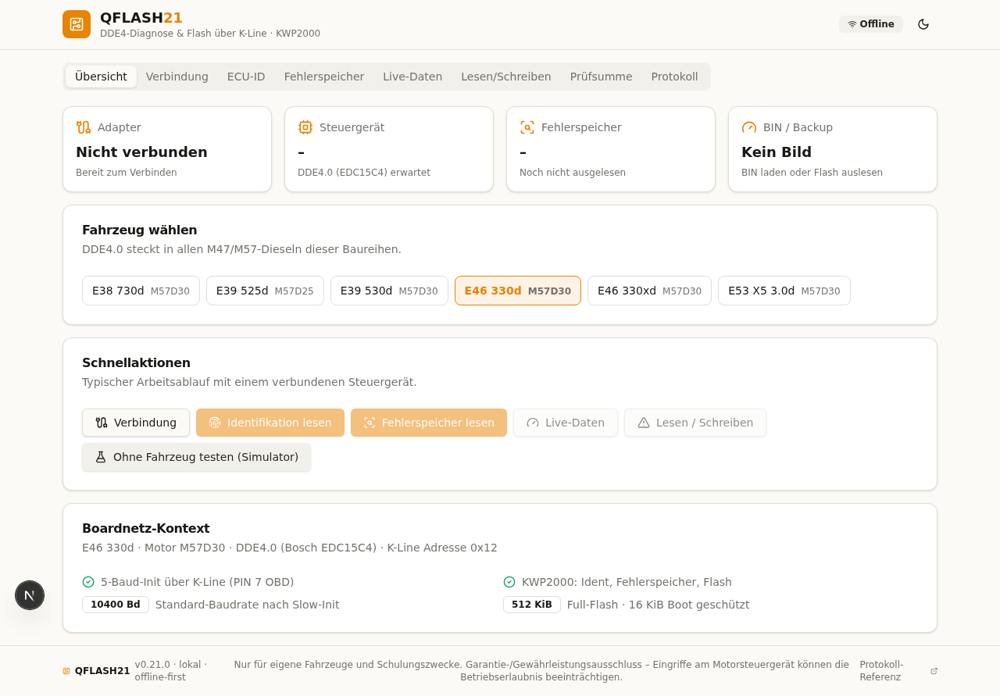 | 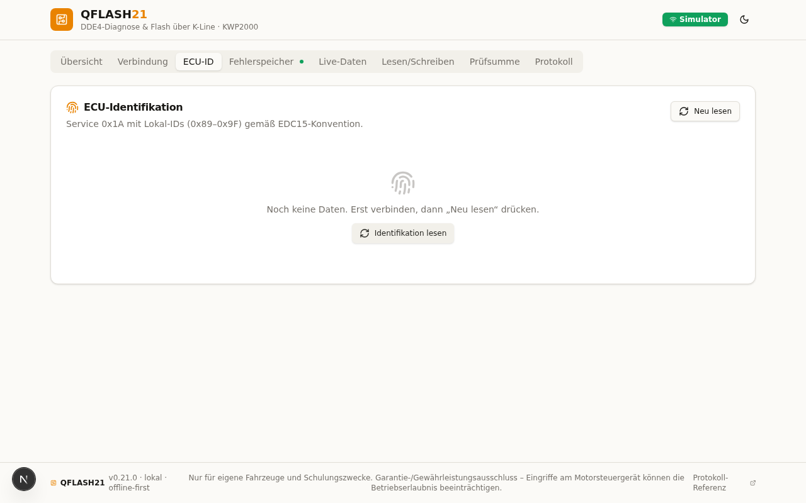 |

| KI-Analyse | Flash |
|---|---|
| 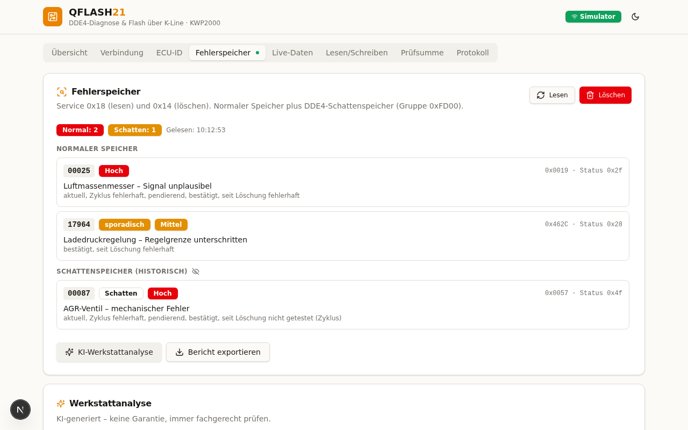 | 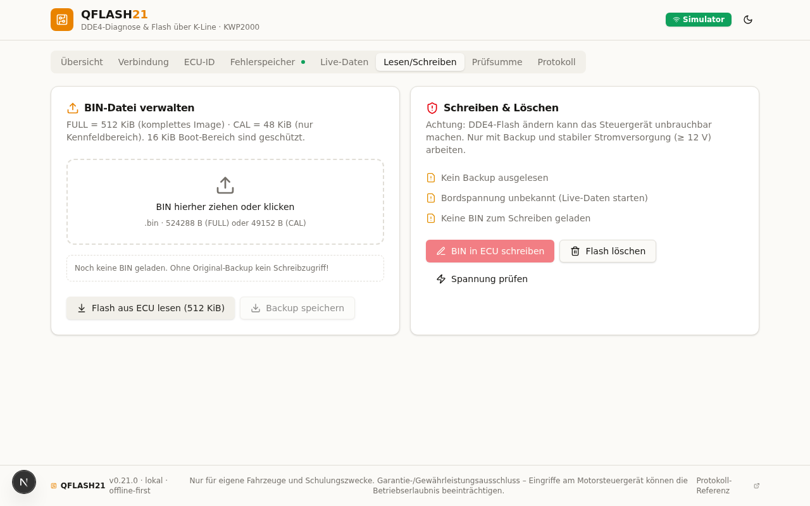 |

| Jobs (mobil) | Live m. Bottom-Nav (mobil) |
|---|---|
|  | 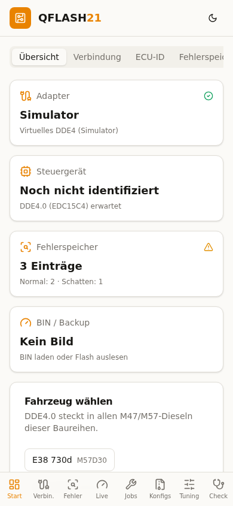 |

---

## 🚀 Deployment (Vercel + Supabase)

Die App ist als Full-Stack-Next.js auf **Vercel** deployed, Datenbank ist **Supabase Postgres**.
Komplette Schritt-für-Schritt-Anleitung: **[DEPLOYMENT.md](DEPLOYMENT.md)**

```bash
# Lokal entwickeln
bun install
cp .env.example .env        # Supabase-Credentials eintragen
bun run db:push             # Schema zu Supabase pushen
bun run dev                 # http://localhost:3000
```

### Architektur

```
src/
├── app/
│   ├── page.tsx              # Haupt-App (9 Tabs + Mobile-Bottom-Nav)
│   └── api/
│       ├── logs/             # OperationLog → Supabase (Prisma)
│       └── analyze-dtc/      # KI-Fehleranalyse (LLM + Offline-Fallback)
├── components/qf/            # UI (Tabs, Panels, Jobs, PWA, Install-Button)
├── lib/kwp/
│   ├── serial-client.ts      # Web Serial: 5-Baud-Init über BREAK, Echo-Handling
│   ├── protocol.ts           # ISO 14230 Framing + NRC-Tabelle
│   ├── dde4.ts               # DDE4-Profil (Services, 51 DTCs, Jobs, Security-Access)
│   ├── checksum.ts           # Bosch-CR2-Prüfsummen
│   ├── bin.ts                # FULL/CAL-Erkennung, Diff, Hex-Dump
│   └── mock.ts               # Virtuelles DDE4 (Simulator, inkl. 0x11/0x30/0x31-Jobs)
├── store/flasher.ts          # Zustand: Verbindungs-/Flash-/Job-Statusmaschine
└── public/                   # PWA: Manifest, Icons, Service Worker
```

### Protokoll-Stack

```
Web Serial (FTDI 0403:6001)
  → 5-Baud-Init (BREAK 200 ms/Bit, Adresse 0x12)
  → KWP2000 Slow-Init → Schlüsselwörter 0x45 0x05
  → StartCommunication (0x81 → 0xC1)
  → Ident / DTC / Live / Security / Flash-Services (ISO 14230-2)
```

### Android-APK (v1.3.0 – TWA, neue applicationId)

**Download:** `https://qflashk.vercel.app/apk/QFLASH21-v1.3.0.apk` (oder [apk/QFLASH21-v1.3.0.apk](apk/QFLASH21-v1.3.0.apk) im Repo).

Die APK ist eine echte **Trusted Web Activity** (AndroidX Browser Helper):
fullscreen in Chrome, **kein URL-Balken** (Domain-Verifizierung via
`/.well-known/assetlinks.json`), Web-Serial-fähig, Fallback Custom Tab. Details,
Installations-Schritte (inkl. MagicOS „Reiner Modus“ und Play Protect) und Build-Anleitung:
**[apk/README.md](apk/README.md)**.

> **v1.3.0** verwendet die neue Paket-ID `de.qflash21.app` und installiert dadurch
> **konfliktfrei neben/alles über** die alten Versionen (v1.0–v1.2 hatten einen anderen
> Signaturschlüssel → „App wurde nicht installiert“). Alte QFLASH21-Apps danach deinstallieren.
> Neu: In der App prüft der Tab **„System-Check“** alle Voraussetzungen (Web Serial,
> Chrome-Version, WebUSB-Fallback, HTTPS, App-Modus) und erzeugt einen kopierbaren
> Diagnose-Bericht.

### Tuning-Wissen (EDC15C4/DDE 4.0)

Der App-Tab **„Tuning-Wissen“** enthält die Kalibrierungs-Referenz für den M57D30
(Stage-1-Ziel 230 PS/480 Nm, Limiter-Kette `IQ_final = min(…)`, Hardware-Guardrails,
AFR-/SVBL-/IQ-Rechner, Klima-Referenz Gelibolu). Grundlage: Fachbericht
„KI-Tuning-Agent für BMW EDC15“ – vollständig aufbereitet in
**[docs/EDC15C4-KI-AGENT.md](docs/EDC15C4-KI-AGENT.md)** (inkl. AGENTS.md-System-Prompt
und MCP-Konfiguration für Google Antigravity).

## 🔒 Sicherheit / Haftungsausschuss

Das Flashen von Steuergeräten kann **dauerhaften Schaden** verursachen (ECU-Brick,
TÜV/ABE-Probleme, Garantieverlust, Rechtswidrigkeit im Straßenverkehr). Diese Software
ist für Bildungszwecke, Teststände und eigene Fahrzeuge mit **ausdrücklichem Backup**
gedacht. Nutzung ausschließlich auf eigene Gefahr.

## Credits

- Protokoll-Referenz: [uholeschak/ediabaslib](https://github.com/uholeschak/ediabaslib)
- Job-/Seiten-Konzept inspiriert von **Deep OBD for BMW** (uholeschak) + [e90-Forum-Thread](https://www.e90-forum.de/forum/thread/58407/)
- ISO 14230 (KWP2000 on K-Line), Bosch EDC15C4 / DDE4.0
